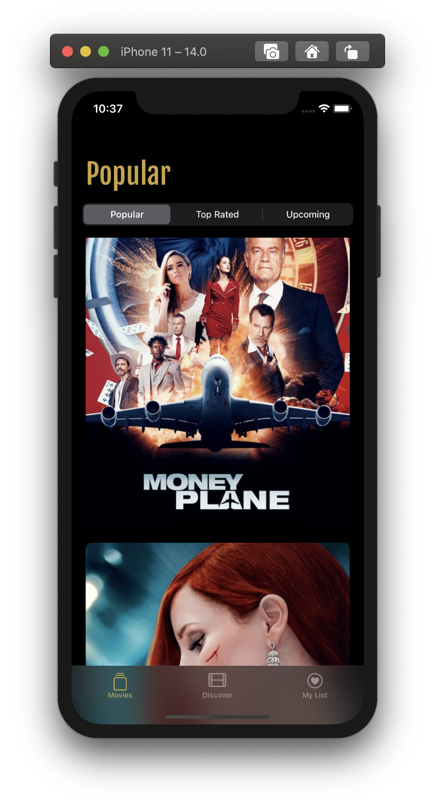
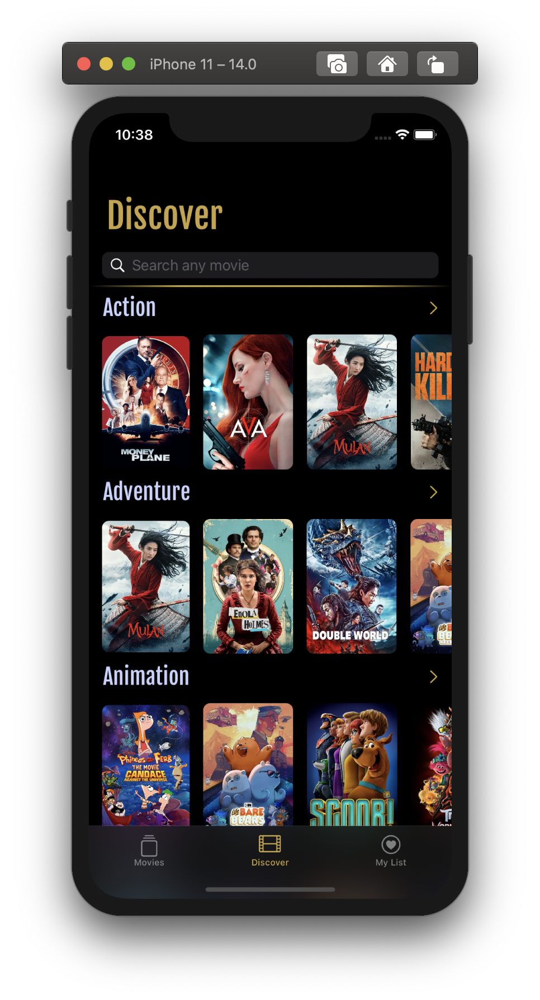
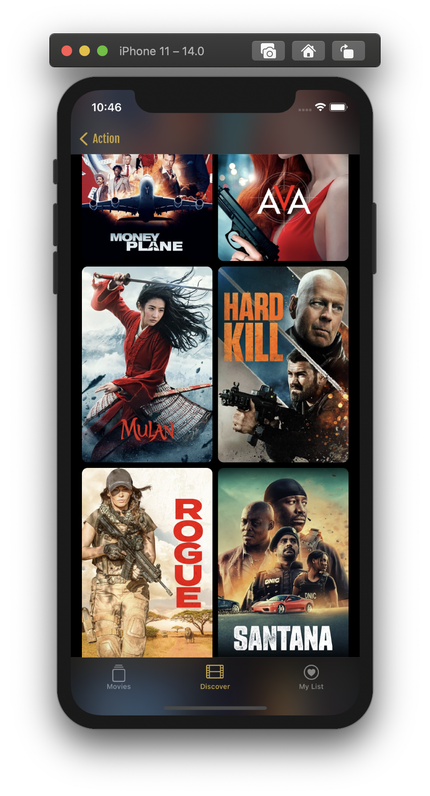
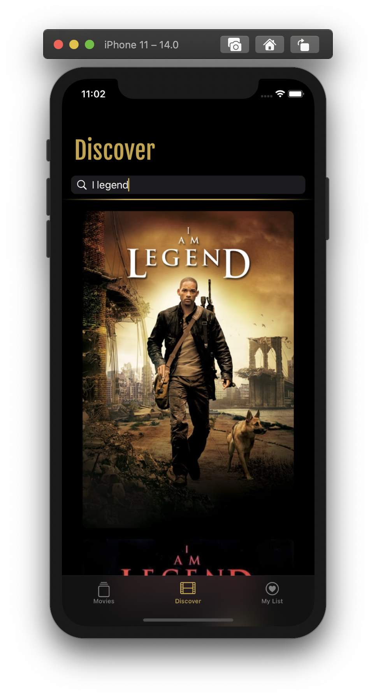
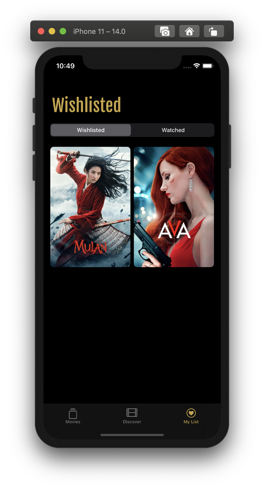
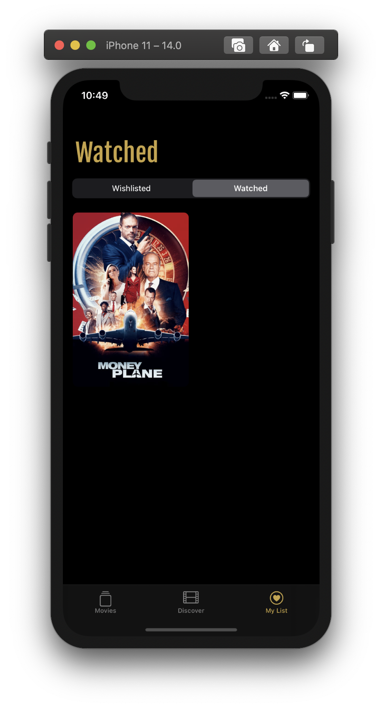
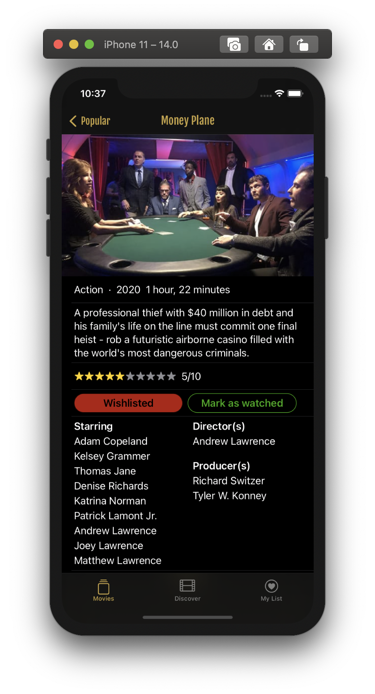
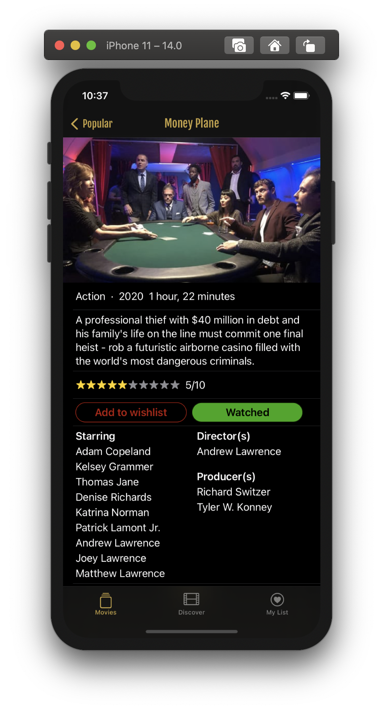
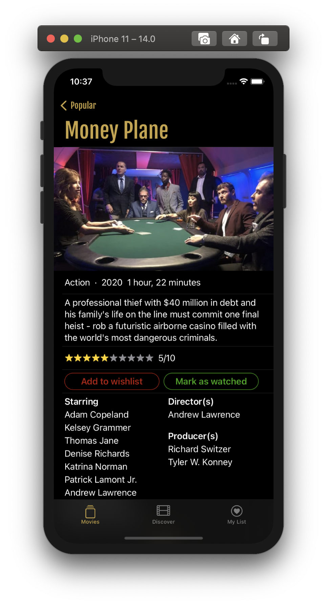
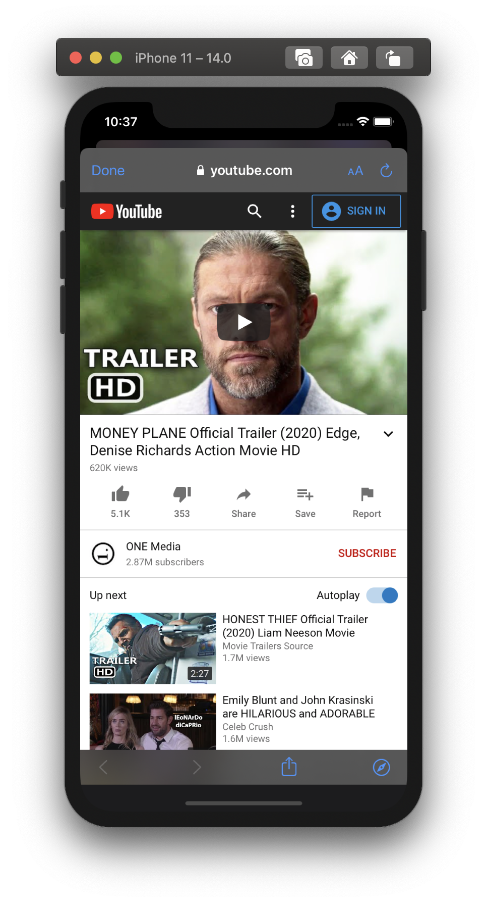

#  OpenClassrooms - iOS developer path - Project 9
## Popcorn Swirl, a movie deal app
XCode 12.0 beta 6  
iOS 14.9 
SwiftUI  
MovieDB API  
CoreData  
Unit/UITests -> work in proggress

<b>Overview</b>  
The app will display lists of movies available to watch on Netflix for various categories, and show the 'Latest’ section by default. 
 
A user can mark a movie as wishlisted or watched to form their personal selection,  and add a note. 
 
A user can view the his list of marked movies. 
 
The user will be able to see trailer for each movie, redirected by safariView to youtube 
 

### Screenshots
 
Main view, in which latest movies are showed, user can choose from picker one of 3 option to discover new movies.  
 

 
Discovery view, in which user will be shown movies separated by theirs genre, also will be able to search for any movie or see more movies in selected genre.  
 

 
List View, is view where user can see his movies marked as wishlisted or watched.  
 

 
Detailed view of movie and selected trailer.  
 

